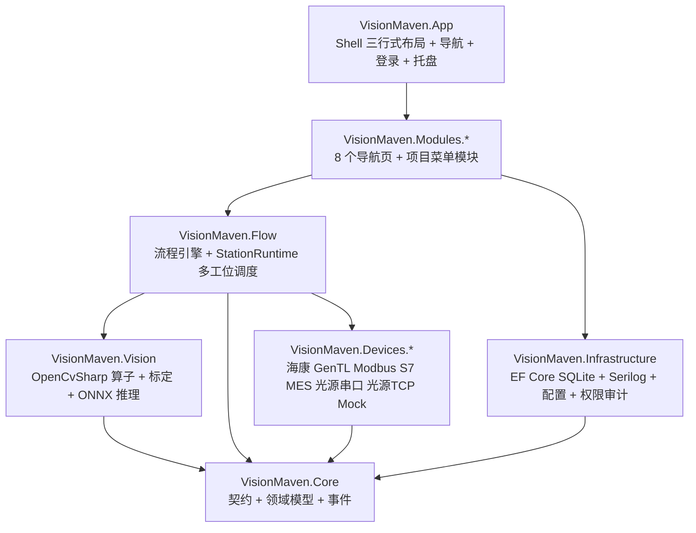
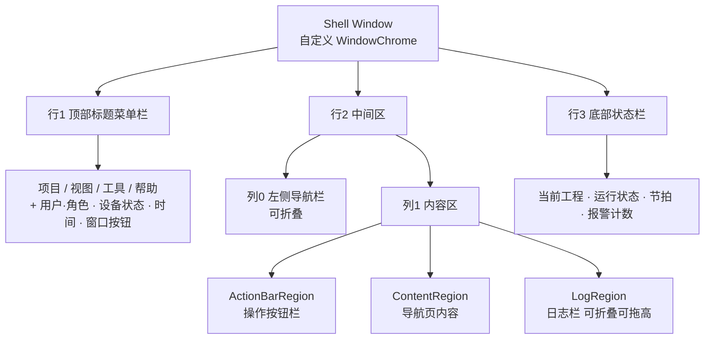

# VisionMaven 开发文档

> 生产线机器视觉与深度学习模型部署框架
> 版本 1.0 ｜ 状态：待评审 ｜ 评审通过后进入编码

---

## 目录

1. [项目概述](#1-项目概述)
2. [技术栈](#2-技术栈)
3. [解决方案结构](#3-解决方案结构)
4. [架构设计](#4-架构设计)
5. [界面规范](#5-界面规范)
6. [核心契约](#6-核心契约)
7. [配置 Schema](#7-配置-schema)
8. [数据库设计](#8-数据库设计)
9. [检测流程引擎](#9-检测流程引擎)
10. [视觉算法与标定](#10-视觉算法与标定)
11. [深度学习推理部署](#11-深度学习推理部署)
12. [扩展指南](#12-扩展指南)
13. [权限与用户管理](#13-权限与用户管理)
14. [日志规范](#14-日志规范)
15. [测试策略](#15-测试策略)
16. [部署与发布](#16-部署与发布)
17. [开发路线图](#17-开发路线图)
18. [编码规范](#18-编码规范)

---

## 1. 项目概述

### 1.1 定位

VisionMaven 是运行于**单台工控机、单进程**的桌面应用，用于在生产线现场部署机器视觉检测与深度学习模型推理。它同时承担两种职责：

| 形态 | 使用者 | 职责 |
|---|---|---|
| 工程配置态 | 工程师 | 工程/配方管理、相机与设备接入、流程编排、算法与模型调参、标定 |
| 运行监控态 | 操作员 | 实时画面与判定结果、节拍与良率、启停与报警处理 |

### 1.2 复用目标

框架的复用性通过**三层复用模型**实现（见 [4.2](#42-三层复用模型)）：

- **引擎层**：与产线完全无关，100% 复用，代码零修改。
- **驱动层**：插件化，新增硬件只新增驱动工程，不改引擎与界面。
- **应用层**：配置驱动，产线差异（工位数、相机数、设备数、流程、模型）全部收敛到工程配置文件。

场景映射：

| 场景 | 配置表现 | 代码改动 |
|---|---|---|
| 单相机单工位 | `stations` 1 项，`cameras` 1 项 | 无 |
| 多相机单工位 | `stations` 1 项，`cameras` N 项 | 无 |
| 单相机多工位 | `stations` N 项，每项 `cameras` 1 项 | 无 |
| 多相机多工位 | `stations` N 项，每项 `cameras` 1..M 项 | 无 |
| 多设备 | `cameras` / `lightControllers` / `commLinks` 追加 | 无 |
| 新增硬件品牌 | 新增一个驱动工程 | 仅新增文件 |
| 新增工艺流程节点 | 新增 `IFlowNode` 实现 | 仅新增文件 |

### 1.3 明确不做的事

为避免范围蔓延，以下内容**不在本期范围**：

- 拖拽式流程画布（改用列表式结构化编排，见 [9.1](#91-流程模型)）
- 分布式 / 多进程部署（已确认形态为单机单进程）
- Web 端、移动端
- 3D 视觉、线扫拼接、多相机立体标定
- 界面内的解释性文字、装饰元素、窗体内部 LOGO
- 云平台对接、远程运维

### 1.4 术语表

| 术语 | 英文 | 含义 |
|---|---|---|
| 工程 | Project | 一套完整检测方案，含工位、设备、流程、模型、参数，可整体导入导出 |
| 工位 | Station | 独立检测单元，持有相机集合、设备绑定、流程与参数；并行调度的最小单位 |
| 设备 | Device | 物理硬件实体：相机、光源控制器、PLC、机器人 |
| 通讯链路 | CommLink | 与上位/下位系统的连接：PLC 链路、机器人链路、MES 链路 |
| 地址表 | PointTable | 链路上的点位定义：地址、数据类型、读写方向、缩放系数 |
| 流程 | Flow | 由节点与连线构成的有向图，描述一次检测的完整执行过程 |
| 节点 | Node | 流程中的最小执行单元，如采集、阈值分割、推理、判定 |
| 算子 | Operator | 图像处理算法实现单元，被算子节点调用 |
| 触发源 | Trigger | 启动一次检测的信号来源：硬触发、软触发、PLC 信号 |
| 会话 | Session | 一次 ONNX Runtime 推理会话（`InferenceSession`），非线程安全 |
| 帧 | Frame | 一帧图像数据及其元信息（时间戳、相机 ID、序号） |

---

## 2. 技术栈

| 领域 | 选型 | 说明 |
|---|---|---|
| 运行时 | .NET 8（`net8.0-windows`），C# 12 | LTS |
| UI | WPF + Prism 9（Prism.DryIoc）+ HandyControl 3.5.x | 导航式界面，模块化装配 |
| MVVM | Prism.Mvvm（`BindableBase` / `DelegateCommand`）+ `IEventAggregator` | 不引入第二套 MVVM 框架 |
| 图像处理 | OpenCvSharp4 + `OpenCvSharp4.runtime.win` + `OpenCvSharp4.Extensions` | 传统算子、标定、坐标映射 |
| 模型推理 | `Microsoft.ML.OnnxRuntime`（CPU 基线包，CUDA 包为可选构建配置） | `SessionOptions` 切换 CPU / CUDA / TensorRT EP |
| 持久化 | EF Core 8 + `Microsoft.Data.Sqlite`（code-first） | 仓储抽象隔离，后续可换 MySQL |
| 日志 | Serilog（File 轮转 Sink + 自定义 UI Sink）+ `Microsoft.Extensions.Logging` 桥接 | 异步写入 |
| PLC / 机器人 | HslCommunication（Modbus TCP、西门子 S7） | 封装在 `IPlcDriver` 之后，便于替换 |
| 光源控制器 | `System.IO.Ports`（RS232/RS485）+ `TcpClient`（私有 TCP 报文） | 首批接入串口与以太网两类 |
| MES 对接 | `HttpClient` + Polly（重试/超时/熔断） | 契约 JSON 可配置 |
| 相机 SDK | 海康 MVS（`MvCameraControl.NET`）+ GenICam/GenTL 消费者 P/Invoke | SDK 缺失不影响主程序启动 |
| 测试 | xUnit + `Microsoft.NET.Test.Sdk` + Moq | 引擎层与 Mock 驱动可测 |

**版本管理**：所有 NuGet 版本集中在 `Directory.Packages.props`（中央包管理，`ManagePackageVersionsCentrally=true`），各 csproj 只写 `<PackageReference Include="X" />` 不带版本号。版本以 NuGet 最新稳定版为准。

**硬性约束**：

- 不使用 `PublishSingleFile`：ONNX Runtime 与相机 SDK 的 native DLL 必须保留在目录中，单文件打包会导致 native 加载失败。
- 不引入 `CommunityToolkit.Mvvm` 或其他 MVVM 框架。
- 不依赖任何商业视觉库（无 Halcon / VisionPro）。

---

## 3. 解决方案结构

### 3.1 工程清单

```
VisionMaven.sln
├─ Directory.Build.props                  统一 TargetFramework / LangVersion / Nullable / 警告级别
├─ Directory.Packages.props               集中管理 NuGet 版本
├─ .editorconfig / .gitignore
├─ README.md                              运行环境、SDK 依赖、发布步骤
├─ docs/开发文档.md                        本文档
├─ src/
│  ├─ VisionMaven.App                     启动壳 + Shell + 登录 + 托盘（唯一可执行工程）
│  ├─ VisionMaven.Core                    零依赖契约层
│  ├─ VisionMaven.Infrastructure          EF Core / 配置 / 权限审计 / 文件存储
│  ├─ VisionMaven.Vision                  OpenCvSharp 算子 + 标定 + ONNX 推理
│  ├─ VisionMaven.Flow                    流程引擎 + StationRuntime 多工位调度
│  ├─ VisionMaven.Devices.Hikvision       海康 MVS 相机驱动
│  ├─ VisionMaven.Devices.GenTL           GenICam/GenTL 通用相机驱动
│  ├─ VisionMaven.Devices.Light.Serial    串口数字光源控制器驱动
│  ├─ VisionMaven.Devices.Light.Tcp       以太网 TCP 光源控制器驱动
│  ├─ VisionMaven.Devices.Modbus          Modbus TCP 驱动
│  ├─ VisionMaven.Devices.S7              西门子 S7 驱动
│  ├─ VisionMaven.Devices.Mes             MES HTTP/WebAPI 客户端
│  ├─ VisionMaven.Devices.Mock            模拟相机 / PLC / 光源控制器
│  ├─ VisionMaven.Modules.Home            首页（运行状态页）
│  ├─ VisionMaven.Modules.FlowEditor      视觉流程
│  ├─ VisionMaven.Modules.Algorithm       算法
│  ├─ VisionMaven.Modules.Model           模型
│  ├─ VisionMaven.Modules.Parameter       参数设置
│  ├─ VisionMaven.Modules.Device          设备管理
│  ├─ VisionMaven.Modules.Communication   通讯管理
│  ├─ VisionMaven.Modules.Security        用户管理
│  └─ VisionMaven.Modules.Project         项目管理（无导航页，仅顶部菜单与对话框）
└─ tests/
   └─ VisionMaven.Tests                   xUnit 测试
```

### 3.2 依赖方向

依赖严格单向向下，**不允许反向引用**：

```
VisionMaven.App
    └─> VisionMaven.Modules.*
            └─> VisionMaven.Flow ──> VisionMaven.Vision ──┐
            └─> VisionMaven.Infrastructure ───────────────┤
                                                          └─> VisionMaven.Core
                    VisionMaven.Devices.* ────────────────────> VisionMaven.Core
```

| 规则 | 说明 |
|---|---|
| `Core` 零外部依赖 | 仅使用 BCL |
| `Devices.*` 只依赖 `Core` | 驱动不认识流程、不认识 UI |
| `Vision` 不认识驱动 | 只处理 `IImageFrame` 抽象，不知道帧来自哪台相机 |
| `Modules.*` 不相互引用 | 跨模块通信走 `IEventAggregator` 或 `Core` 中的共享服务契约 |
| `App` 只做装配 | Shell 与启动逻辑，业务逻辑不得写在 App 中 |

### 3.3 运行时目录布局

```
VisionMaven.exe
├─ projects/                       工程目录，每个工程一个子目录
│  └─ {ProjectId}/
│     ├─ project.json              工程主配置
│     ├─ models/                   ONNX 模型文件
│     ├─ labels/                   标签集文件
│     ├─ templates/                模板匹配模板文件
│     ├─ calibration/              标定文件
│     └─ images/                   样本与结果图片（按策略滚动清理）
├─ data/
│  └─ visionmaven.db               SQLite 数据库
├─ logs/                           Serilog 轮转日志
├─ plugins/                        驱动插件目录（约定扫描）
└─ models/                         全局模型缓存（可选，优先级低于工程内 models/）
```

---

## 4. 架构设计

### 4.1 分层



### 4.2 三层复用模型

**第一层：引擎层（零业务，100% 复用）**

`Core`（契约/模型/事件）、`Infrastructure`（持久化/配置/日志）、`Vision`（算子/标定/推理）、`Flow`（流程引擎/多工位运行时）。

此层禁止出现任何与产线、产品、工位数量相关的硬编码。代码中不允许出现 `Station1`、`Camera2` 这类具体命名，一律以集合与循环处理。

**第二层：驱动层（插件化）**

相机、PLC、机器人、MES、光源控制器全部实现 `IDeviceDriver` 体系：

- 编译期特性 `[VisionDriver("key")]` 声明驱动标识与支持能力
- 启动时通过约定目录 `plugins/` + `AssemblyLoadContext` 扫描加载
- SDK 缺失（如未装海康 MVS）只记告警并跳过，不抛致命异常

新增硬件 = 新增一个驱动工程 + 一个特性标注，**不改动引擎与界面**。

**第三层：应用层（配置驱动）**

「工位（Station）」是一等公民。`ProjectConfig` 描述 1..N 个工位，每个工位独立持有：

- 相机集合（`cameraIds`）
- 设备绑定（`deviceBindings`）
- 流程定义（`flowId`）
- 触发源配置（`trigger`）
- 工位级参数（`parameters`）

运行时由 `StationRuntimeFactory` 按配置实例化 N 个 `StationRuntime`，**单工位与多工位走完全相同的代码路径**。

### 4.3 Shell 区域划分



**Region 与职责**

| Region | 承载内容 | 谁写入 |
|---|---|---|
| `ActionBarRegion` | 当前页上下文操作按钮 | 当前导航页 ViewModel |
| `ContentRegion` | 导航页视图 | `INavigationCatalog` |
| `LogRegion` | 全局日志列表与筛选 | Shell 自身 |

导航页**只允许**向 `ContentRegion` 注入视图，不得占用其他 Region。

**自定义 WindowChrome 要点**

- 保留拖拽、双击最大化、贴边吸附、边缘缩放手势
- 最大化时按当前显示器工作区裁剪，避免超出屏幕
- 响应多显示器 DPI 变化（`DpiChanged`），重新计算标题栏与图标尺寸
- 自定义窗口按钮（最小化/最大化/关闭）需处理 `SystemCommands` 与还原状态图标切换

### 4.4 运行时数据流

```
相机回调 / PLC 触发信号
        ↓
有界 Channel（容量 1，DropOldest，最新帧优先）
        ↓
StationRuntime 调度（每工位独立 Task + CancellationTokenSource）
        ↓
FlowEngine 依拓扑执行节点：采集 → 预处理 → 算子/推理 → 判定
        ↓
结果回写 PLC / 上报 MES
        ↓
结果与图像按策略落盘（SQLite 记录 + 图片文件）
        ↓
统计经节流上报 UI（IEventAggregator，预览 15~25fps、统计 1Hz）
```

### 4.5 线程与并发模型

| 组件 | 线程模型 | 说明 |
|---|---|---|
| 相机采集 | SDK 回调线程 | 只做入队，不做任何处理 |
| 帧队列 | `Channel<T>` 有界，容量 1，`DropOldest` | 保证处理最新帧，避免旧帧堆积拖慢节拍 |
| 工位调度 | 每工位一个长驻 `Task` | 独立 `CancellationTokenSource`，可单独启停 |
| 流程节点 | 在工位调度线程上串行执行 | 需并行的分支显式 `Task.WhenAll` |
| 通讯读写 | 独立轮询/回调 + `async` | 不阻塞工位线程 |
| 推理 | 会话独占，同一会话不跨线程 | 见 [11.4](#114-会话池与线程安全) |
| UI | UI 线程只做渲染 | 禁止在 UI 线程执行 IO、采集、推理 |

**异常隔离**：任工位抛出未处理异常时，仅将该工位置为 `Alarm` 状态并记录，其余工位继续运行。工位级别的异常不得冒泡到应用级。

### 4.6 性能与可靠性

- **图像内存**：`BufferPool` 复用 `Mat`；算子以 ROI 裁剪降低像素量；`IImageFrame` 全程 `IDisposable`，避免进入 GC 压力区。
- **目标节拍**：单站单帧全链路 ≤ 相机周期（30fps → 33ms）；推理输入长边限制 640 / 960；逐节点耗时可在参数设置页查看。
- **日志栏节流**：UI Sink 环形缓冲上限 5000 条，批量刷新约 100ms；折叠时暂停 UI 刷新但仍入缓冲。
- **数据保护**：用户密码 PBKDF2 + 随机盐；MES Token / 密钥用 DPAPI 加密落盘；审计记录登录、参数修改、模型替换、启停等关键操作。

---

## 5. 界面规范

### 5.1 三行式布局

```
┌────────────────────────────────────────────────────────────────────────────┐
│ 行1 顶部标题菜单栏（高 36）                                                 │
│  应用名          项目  视图  工具  帮助        用户·角色  设备状态  时间  □× │
├──────────┬─────────────────────────────────────────────────────────────────┤
│          │ 操作按钮栏（高 40）                                              │
│ 行2 左侧  ├─────────────────────────────────────────────────────────────────┤
│ 导航栏    │                                                                 │
│ 宽 200    │ 导航页内容 ContentRegion                                        │
│ 可折叠至  │                                                                 │
│ 48       ├─────────────────────────────────────────────────────────────────┤
│          │ 日志栏（默认高 140，可折叠至 28，可拖高）                          │
├──────────┴─────────────────────────────────────────────────────────────────┤
│ 行3 底部状态栏（高 26）                                                     │
└────────────────────────────────────────────────────────────────────────────┘
```

**行尺寸**

| 区域 | 尺寸 | 约束 |
|---|---|---|
| 行1 顶部标题菜单栏 | 高 36 | 固定 |
| 行2 左侧导航栏 | 宽 200，折叠后 48 | `GridSplitter` 可调 |
| 行2 操作按钮栏 | 高 40 | 固定 |
| 行2 日志栏 | 默认 140，折叠 28 | `GridSplitter` 可调 |
| 行3 底部状态栏 | 高 26 | 固定 |

**顶部标题菜单栏**

| 位置 | 内容 |
|---|---|
| 左 | 应用名（纯文字） |
| 中 | 「项目 / 视图 / 工具 / 帮助」四个文本菜单 |
| 右 | 当前用户·角色、设备在线状态点、系统时间、最小化/最大化/关闭 |

「项目」菜单项（项目管理的唯一入口）：

| 菜单项 | 快捷键 | 说明 |
|---|---|---|
| 新建工程 | Ctrl+N | 新建空工程并进入配置 |
| 打开工程 | Ctrl+O | 列出 `projects/` 下工程 |
| 保存 | Ctrl+S | 保存当前工程配置 |
| 另存为 | Ctrl+Shift+S | 复制为新工程 |
| 导入工程 | — | 从 `.vmproj` 包导入 |
| 导出工程 | — | 导出为 `.vmproj` 包（含模型与标定） |
| 最近工程 | — | 最近 10 个工程 |
| 退出 | Alt+F4 | 退出前校验未保存改动 |

**视图菜单**：显示/隐藏 左侧导航栏、日志栏；折叠/展开 日志栏。
**工具菜单**：设备发现、日志目录、数据库备份。
**帮助菜单**：关于（版本号与版权仅在此处出现，不在状态栏）。

### 5.2 导航栏

固定 8 项，**顺序不可变更**：

| 序号 | 导航项 | 图标 | 所需权限 | 对应模块 |
|---|---|---|---|---|
| 1 | 首页 | `Home` | `nav.home` | `Modules.Home` |
| 2 | 视觉流程 | `Sitemap` | `nav.flow` | `Modules.FlowEditor` |
| 3 | 算法 | `Filter` | `nav.algorithm` | `Modules.Algorithm` |
| 4 | 模型 | `Cube` | `nav.model` | `Modules.Model` |
| 5 | 参数设置 | `Tune` | `nav.parameter` | `Modules.Parameter` |
| 6 | 设备管理 | `Camera` | `nav.device` | `Modules.Device` |
| 7 | 通讯管理 | `Lan` | `nav.communication` | `Modules.Communication` |
| 8 | 用户管理 | `User` | `nav.security` | `Modules.Security` |

- 图标一律使用 HandyControl 内置 `PackIcon`，不引入图片资源。
- 权限不足的导航项**不渲染**（不是置灰）。
- 折叠后仅显示图标，悬浮显示标题。
- 当前项高亮，使用强调色左边条 + 背景色。

### 5.3 操作按钮栏

- 全局唯一，位于内容区顶部，高 40。
- 内容由当前导航页在进入时通过 `IActionBarService.Set(...)` 注入，离开时 `Clear()`。
- 页面**不得**在内容区内部再次绘制工具栏或重复放同类按钮。
- 空集合时保留固定高度占位，避免内容区跳动。
- 需二次确认的按钮（删除、替换、启停）通过 `ActionItem.RequiresConfirm` 声明，由 Shell 统一弹确认。

### 5.4 日志栏

- 全局唯一，Shell 承载，所有页面共用一条日志流。
- 左侧：级别筛选（Verbose / Debug / Info / Warn / Error / Fatal）、关键字输入框。
- 右侧：清空、自动滚动开关、折叠按钮。
- 列表：等宽字体、时间戳、级别色条、来源、消息。
- 折叠后仅一行显示最新一条日志。
- **各页面不再自带日志输出区**；设备连接测试、通讯读写调试等结果统一写入全局日志栏。

### 5.5 底部状态栏

仅显示运行只读信息，从左到右：

| 位置 | 内容 |
|---|---|
| 左 | 当前工程名 / 未打开工程 |
| 中 | 运行状态灯（停止 / 运行中 / 报警） |
| 中 | 节拍（ms/件）、良率（%） |
| 右 | 未确认报警计数 |

**不显示**版本号、配置文件路径、Git 提交号等开发期信息。

### 5.6 设计令牌

| 类别 | 令牌 | 值 | 用途 |
|---|---|---|---|
| 主色 | `PrimaryBrush` | `#1F6FEB` | 主操作按钮、选中态 |
| 主色亮 | `PrimaryHoverBrush` | `#388BFD` | 悬浮 |
| 主色柔 | `PrimarySoftBrush` | `#58A6FF` | 强调文字、图形 |
| 背景-最深 | `BackgroundBrush` | `#1A1D21` | 窗口底色 |
| 背景-中 | `PanelBrush` | `#22262B` | 面板、导航栏 |
| 背景-浅 | `SurfaceBrush` | `#2B3036` | 卡片、表头、输入框 |
| 文本-主 | `TextPrimaryBrush` | `#E6EDF3` | 正文 |
| 文本-次 | `TextSecondaryBrush` | `#8B949E` | 次要信息、单位 |
| 文本-反白 | `TextInverseBrush` | `#FFFFFF` | 主按钮文字 |
| 状态-正常 | `SuccessBrush` | `#3FB950` | OK、已连接、运行中 |
| 状态-警告 | `WarningBrush` | `#D29922` | 待确认、超时 |
| 状态-故障 | `DangerBrush` | `#F85149` | NG、报警、断线 |
| 状态-信息 | `InfoBrush` | `#58A6FF` | 提示、进行中 |

**字体**：思源黑体（`SourceHanSansSC`）。标题 20px/600，小标题 15px/500，正文 13px/400，表格与日志 12px/400（等宽用 `Cascadia Mono`）。

### 5.7 UI 红线（硬约束）

以下为**不可协商**的界面约束，编码评审时逐条检查：

1. 界面只放**必需的信息与输入控件**：字段名、按钮、校验错误输出、必要的取值提示（如"当前分辨率 2448×2048"）。
2. **禁止**解释性文字：不得在字段旁加灰色小字说明含义、取值范围、注意事项；不得加提示段落；不得加题头描述（版本号、配置文件路径）。
3. 解释性内容一律写入 `README.md` 与本文档。分工原则：**界面负责操作，文档负责解释**。
4. 必须可见的约束用**结构性方式**表达，不写句子。例：页签名写成 `触发源（改动需重启）`，而不是在页签内加一行说明文字。
5. **禁止**装饰性元素；**禁止**把 LOGO 以 `PictureBox` 形式放进窗体内部。LOGO 只允许出现在三处：exe 图标、窗体标题栏 Icon、托盘图标。
6. **不做未被要求的扩展**：需求只提到 A 就不顺带实现 B；拿不准时先只做 A 并说明。

### 5.8 页面清单

| 页面 | 内容要点 |
|---|---|
| 首页（运行状态页） | 工位标签条（状态色）、实时画面网格（叠加检测框/类别/置信度）、OK/NG 与良率计数与节拍、工位与绑定配置面板（工位增删、工位-相机-设备绑定表）、启停/复位/单次触发/报警确认、报警列表 |
| 视觉流程 | 工位与流程选择、节点列表（顺序/并行/分支标记，增删、上下移、启用停用）、节点参数面板（按 `TypeKey` 动态生成）、触发源设置、单帧试运行与逐节点耗时表 |
| 算法 | 算子类别树（预处理/阈值/Blob/模板匹配/找线找圆/测量/标定）、参数表单、图像预览与结果叠加 |
| 模型 | 模型库表格（名称/版本/输入尺寸/标签数/路径）、导入与删除、推理设置（置信度/NMS/精度/推理设备/会话数）、测试推理与结果叠加 |
| 参数设置 | 参数分组树（全局/工位级）、参数表单、图像源选择（离线文件/相机）、执行、结果叠加预览、逐节点耗时与置信度表、保存到工程 |
| 设备管理 | 子页签（相机/光源控制器/其他设备，**由设备类型注册表动态生成**）、设备表格（名称/驱动/连接状态/操作）、按驱动动态渲染参数表单、设备发现、连接/断开、实时预览 |
| 通讯管理 | 链路表格（PLC/机器人/MES、协议、地址、状态、操作）、连接参数表单、地址表（地址/数据类型/读写方向/缩放系数）、手动读写调试面板 |
| 用户管理 | 用户表格（账号/角色/状态）、新增/编辑/禁用、重置密码、权限矩阵、审计日志查询 |

**页面通用模板**：操作按钮栏由页面注入 → 主体区（列表/表单/预览）→ 无页内日志区。

---

## 6. 核心契约

### 6.1 设备驱动

```csharp
namespace VisionMaven.Core.Abstractions;

/// <summary>设备驱动统一契约：相机 / PLC / 机器人 / MES / 光源控制器均实现此接口。</summary>
public interface IDeviceDriver : IAsyncDisposable
{
    /// <summary>驱动标识，与 [VisionDriver("...")] 一致，工程配置借此定位驱动。</summary>
    string DriverKey { get; }

    string DeviceId { get; }

    DeviceKind Kind { get; }

    DeviceState State { get; }

    Task ConnectAsync(CancellationToken ct);

    Task DisconnectAsync();

    event EventHandler<DeviceStateChangedEventArgs> StateChanged;
}

public enum DeviceKind
{
    Camera = 0,
    LightController = 1,
    Plc = 2,
    Robot = 3,
    Mes = 4,
    Other = 99
}

public enum DeviceState
{
    Disconnected = 0,
    Connecting = 1,
    Ready = 2,
    Alarm = 3
}
```

### 6.2 相机

```csharp
/// <summary>相机：屏蔽厂商差异，硬触发与软触发统一从 GetFrameAsync / FrameArrived 出口。</summary>
public interface ICamera : IDeviceDriver
{
    CameraCapabilities Capabilities { get; }

    Task StartGrabbingAsync(CancellationToken ct);

    Task StopGrabbingAsync();

    Task<IImageFrame> GetFrameAsync(CancellationToken ct);

    Task SetParameterAsync(string key, double value, CancellationToken ct);

    Task<double> GetParameterAsync(string key, CancellationToken ct);

    event EventHandler<FrameArrivedEventArgs> FrameArrived;
}

public sealed record CameraCapabilities(
    string[] SupportedParameters,
    PixelFormat[] SupportedPixelFormats,
    TriggerMode[] SupportedTriggerModes,
    int MaxWidth,
    int MaxHeight);
```

### 6.3 光源控制器

```csharp
/// <summary>光源控制器：多通道亮度与频闪，串口实现与 TCP 实现共用此出口。</summary>
public interface ILightController : IDeviceDriver
{
    int ChannelCount { get; }

    Task SetBrightnessAsync(int channel, int value, CancellationToken ct);

    Task SetChannelEnabledAsync(int channel, bool enabled, CancellationToken ct);

    Task<int?> ReadBrightnessAsync(int channel, CancellationToken ct);

    Task SetTriggerModeAsync(LightTriggerMode mode, CancellationToken ct);
}

public enum LightTriggerMode
{
    Continuous = 0,
    Strobe = 1,
    ExternalTrigger = 2
}
```

### 6.4 通讯类设备

```csharp
public interface IPlcDriver : IDeviceDriver
{
    Task<T> ReadAsync<T>(string address, CancellationToken ct) where T : struct;

    Task WriteAsync<T>(string address, T value, CancellationToken ct) where T : struct;

    Task<bool[]> ReadBitsAsync(string address, int count, CancellationToken ct);

    Task WriteBitsAsync(string address, bool[] values, CancellationToken ct);
}

public interface IRobotDriver : IDeviceDriver
{
    Task<RobotPose> ReadPoseAsync(CancellationToken ct);

    Task SendCommandAsync(string command, CancellationToken ct);
}

public interface IMesClient : IDeviceDriver
{
    Task<MesResult> UploadInspectionAsync(InspectionRecord record, CancellationToken ct);

    Task<bool> HeartbeatAsync(CancellationToken ct);
}
```

### 6.5 图像算子与推理引擎

```csharp
/// <summary>图像算子：以算子参数驱动，同一个算子可被多个流程节点复用。</summary>
public interface IImageOperator
{
    string TypeKey { get; }

    OperatorParameterSchema Schema { get; }

    Task<OperatorResult> ExecuteAsync(IImageFrame input, OperatorParameters parameters, CancellationToken ct);
}

/// <summary>推理引擎：模型描述与运行选项分离，同一引擎可服务多工位、多模型。</summary>
public interface IInferenceEngine : IAsyncDisposable
{
    string EngineKey { get; }

    Task LoadAsync(ModelDescriptor descriptor, InferenceOptions options, CancellationToken ct);

    Task<InferenceResult> InferAsync(IImageFrame frame, CancellationToken ct);

    Task UnloadAsync();
}
```

### 6.6 流程节点

```csharp
/// <summary>流程节点：TypeKey 对应工程配置中的节点类型，新增算子只需新增实现 + 标注，无需改引擎。</summary>
public interface IFlowNode
{
    string TypeKey { get; }

    IReadOnlyList<string> InputPorts { get; }

    IReadOnlyList<string> OutputPorts { get; }

    Task<NodeResult> ExecuteAsync(FlowContext context, CancellationToken ct);
}

public sealed class FlowContext
{
    public string StationId { get; init; } = string.Empty;
    public string FlowId { get; init; } = string.Empty;
    public IDictionary<string, object?> Variables { get; init; } = new Dictionary<string, object?>();
    public IReadOnlyDictionary<string, string> Parameters { get; init; } = new Dictionary<string, string>();
    public IReadOnlyDictionary<string, string> Inputs { get; init; } = new Dictionary<string, string>();
    public CancellationToken StationToken { get; init; }
}
```

### 6.7 Shell 服务契约

```csharp
namespace VisionMaven.App.Services;

/// <summary>操作按钮栏：页面进入时注入按钮集合，离开时清空；Shell 只负责呈现与确认。</summary>
public interface IActionBarService
{
    IReadOnlyList<ActionItem> Items { get; }

    void Set(IEnumerable<ActionItem> items);

    void Clear();

    event EventHandler<ActionBarChangedEventArgs> Changed;
}

public sealed record ActionItem(
    string Key,
    string Text,
    ICommand Command,
    string? IconKey = null,
    ActionItemStyle Style = ActionItemStyle.Default,
    bool RequiresConfirm = false);

public enum ActionItemStyle
{
    Default = 0,
    Primary = 1,
    Danger = 2
}
```

```csharp
namespace VisionMaven.App.Navigation;

/// <summary>导航目录：模块自行注册，带排序与权限，权限不足则不显示。</summary>
public interface INavigationCatalog
{
    void Register(NavigationItem item);

    IReadOnlyList<NavigationItem> VisibleItems(IPrincipal user);

    void NavigateTo(string key);
}

public sealed record NavigationItem(
    string Key,
    string Title,
    string IconKey,
    int Order,
    string ViewName,
    string? RequiredPermission = null);

/// <summary>顶部菜单注册表：模块可向「项目 / 视图 / 工具 / 帮助」四个菜单追加项目。</summary>
public interface ITopMenuRegistry
{
    void AddItem(TopMenuGroup group, TopMenuItem item);
}

public enum TopMenuGroup
{
    Project = 0,
    View = 1,
    Tools = 2,
    Help = 3
}
```

```csharp
/// <summary>设备类型注册表：设备管理页据此动态生成子页签并排序。</summary>
public interface IDeviceTypeRegistry
{
    void Register(DeviceTypeDescriptor descriptor);

    IReadOnlyList<DeviceTypeDescriptor> GetSubTabs();
}

public sealed record DeviceTypeDescriptor(
    DeviceKind Kind,
    string Title,
    string IconKey,
    int Order);
```

### 6.8 驱动注册

```csharp
namespace VisionMaven.Core.Abstractions;

/// <summary>标记一个设备驱动实现，供启动时扫描注册。</summary>
[AttributeUsage(AttributeTargets.Class, AllowMultiple = false, Inherited = false)]
public sealed class VisionDriverAttribute : Attribute
{
    public VisionDriverAttribute(string driverKey, DeviceKind kind)
    {
        DriverKey = driverKey;
        Kind = kind;
    }

    public string DriverKey { get; }

    public DeviceKind Kind { get; }

    /// <summary>界面上显示的驱动名，如「海康威视 MVS」。</summary>
    public string? DisplayName { get; set; }

    /// <summary>厂商 SDK 依赖锚点，缺失时用于生成诊断提示。</summary>
    public string? SdkHint { get; set; }
}

/// <summary>标记一个流程节点实现，供启动时扫描注册。</summary>
[AttributeUsage(AttributeTargets.Class, AllowMultiple = false, Inherited = false)]
public sealed class FlowNodeAttribute : Attribute
{
    public FlowNodeAttribute(string typeKey, string displayName)
    {
        TypeKey = typeKey;
        DisplayName = displayName;
    }

    public string TypeKey { get; }

    public string DisplayName { get; }

    public int Order { get; set; }
}
```

### 6.9 事件

```csharp
namespace VisionMaven.Core.Events;

public sealed record FrameArrivedEvent(string DeviceId, string StationId, DateTimeOffset Timestamp);

public sealed record DeviceStateChangedEvent(string DeviceId, DeviceState OldState, DeviceState NewState);

public sealed record InspectionCompletedEvent(InspectionRecord Record);

public sealed record AlarmRaisedEvent(AlarmRecord Alarm);

public sealed record StationStateChangedEvent(string StationId, StationState State);

public sealed record ActionBarChangedEvent(IReadOnlyList<ActionItem> Items);
```

---

## 7. 配置 Schema

### 7.1 存储策略

**双轨存储**：

| 内容 | 存储位置 | 理由 |
|---|---|---|
| 工程配置（工位、相机、设备、流程、模型、参数） | `projects/{ProjectId}/project.json` | 人可读、可 diff、可整包导入导出 |
| 用户、角色、权限 | SQLite | 需要事务与查询 |
| 运行记录、检测结果、缺陷、报警、审计 | SQLite | 数据量大，需索引与统计 |
| 模型文件、模板、标定文件、图片 | 文件系统 | 二进制大文件不入库 |

### 7.2 project.json 完整示例

```json
{
  "schemaVersion": "1.0",
  "projectId": "PRJ-0001",
  "name": "上盖外观检测",
  "code": "LINE-A-VISION",
  "description": "",
  "createdAt": "2026-09-18T09:00:00+08:00",
  "updatedAt": "2026-09-18T09:00:00+08:00",

  "stations": [
    {
      "stationId": "ST01",
      "name": "工位1-上盖",
      "enabled": true,
      "cameraIds": ["CAM01", "CAM02"],
      "deviceBindings": ["PLC01", "LT01"],
      "flowId": "FLOW-ST01",
      "trigger": {
        "source": "Plc",
        "deviceId": "PLC01",
        "address": "M100",
        "edge": "Rising",
        "timeoutMs": 2000,
        "debounceMs": 20
      },
      "parameters": {
        "ExposureUs": "8000",
        "ScoreThreshold": "0.75"
      }
    }
  ],

  "cameras": [
    {
      "deviceId": "CAM01",
      "name": "上盖-正面",
      "driverKey": "hikvision",
      "kind": "Camera",
      "enabled": true,
      "connection": {
        "serialNumber": "DA1234567",
        "ip": "",
        "interface": "GigE"
      },
      "stream": {
        "exposureUs": 8000,
        "gain": 2.0,
        "triggerMode": "Hardware",
        "triggerSource": "Line0",
        "pixelFormat": "Mono8",
        "roi": { "x": 0, "y": 0, "width": 2448, "height": 2048 },
        "frameRateLimit": 30
      },
      "calibration": {
        "type": "NinePoint",
        "mmPerPixel": 0.035,
        "homography": [1.0, 0.0, 0.0, 0.0, 1.0, 0.0, 0.0, 0.0, 1.0],
        "file": "calibration/CAM01_calib.json"
      }
    }
  ],

  "lightControllers": [
    {
      "deviceId": "LT01",
      "name": "环形光源控制器",
      "driverKey": "light.serial",
      "kind": "LightController",
      "enabled": true,
      "connection": {
        "portName": "COM3",
        "baudRate": 9600,
        "dataBits": 8,
        "stopBits": "One",
        "parity": "None",
        "vendor": "opt"
      },
      "channels": [
        { "index": 0, "name": "环形", "brightness": 128, "enabled": true },
        { "index": 1, "name": "同轴", "brightness": 96, "enabled": true }
      ],
      "triggerMode": "Strobe"
    }
  ],

  "commLinks": [
    {
      "deviceId": "PLC01",
      "name": "主控PLC",
      "driverKey": "siemens.s7",
      "kind": "Plc",
      "enabled": true,
      "connection": {
        "ip": "192.168.0.10",
        "port": 102,
        "rack": 0,
        "slot": 1
      },
      "pollingMs": 100,
      "heartbeatMs": 1000,
      "reconnectMs": 3000,
      "points": [
        { "name": "启动", "address": "M100", "dataType": "Bool", "direction": "Read" },
        { "name": "复位", "address": "M101", "dataType": "Bool", "direction": "Read" },
        { "name": "触发", "address": "M110", "dataType": "Bool", "direction": "Read" },
        { "name": "结果OK", "address": "M200", "dataType": "Bool", "direction": "Write" },
        { "name": "结果NG", "address": "M201", "dataType": "Bool", "direction": "Write" },
        { "name": "节拍", "address": "D1000", "dataType": "Int32", "direction": "Write", "scale": 1 }
      ]
    },
    {
      "deviceId": "MES01",
      "name": "产线MES",
      "driverKey": "mes.http",
      "kind": "Mes",
      "enabled": true,
      "connection": {
        "baseUrl": "http://mes.local/api",
        "uploadPath": "/inspection/upload",
        "heartbeatPath": "/heartbeat",
        "timeoutMs": 3000,
        "retryCount": 3,
        "tokenHeader": "X-Token"
      }
    }
  ],

  "modelLibrary": [
    {
      "modelId": "MDL001",
      "name": "上盖缺陷检测",
      "task": "Detection",
      "version": "v3",
      "path": "models/cover_v3.onnx",
      "labels": "labels/cover.txt",
      "input": { "width": 640, "height": 640, "layout": "NCHW", "normalize": "Div255" },
      "confidence": 0.35,
      "nms": 0.45,
      "maxDetections": 100,
      "precision": "FP16",
      "device": "CUDA",
      "sessions": 2
    }
  ],

  "flows": [
    {
      "flowId": "FLOW-ST01",
      "name": "上盖检测流程",
      "failureStrategy": "Abort",
      "nodes": [
        {
          "nodeId": "N1",
          "typeKey": "acquire",
          "name": "采集",
          "enabled": true,
          "order": 1,
          "mode": "Sequential",
          "parameters": { "cameraId": "CAM01" },
          "inputs": {},
          "next": ["N2"]
        },
        {
          "nodeId": "N2",
          "typeKey": "preprocess.gray",
          "name": "灰度化",
          "enabled": true,
          "order": 2,
          "mode": "Sequential",
          "parameters": { "method": "Weighted" },
          "inputs": { "image": "N1.image" },
          "next": ["N3"]
        },
        {
          "nodeId": "N3",
          "typeKey": "inference.onnx",
          "name": "缺陷检测",
          "enabled": true,
          "order": 3,
          "mode": "Sequential",
          "parameters": { "modelId": "MDL001" },
          "inputs": { "image": "N2.image" },
          "next": ["N4"]
        },
        {
          "nodeId": "N4",
          "typeKey": "judge.threshold",
          "name": "判定",
          "enabled": true,
          "order": 4,
          "mode": "Sequential",
          "parameters": { "field": "maxScore", "op": ">=", "value": "0.35" },
          "inputs": { "input": "N3.result" },
          "next": ["N5"]
        },
        {
          "nodeId": "N5",
          "typeKey": "output.plc",
          "name": "结果输出",
          "enabled": true,
          "order": 5,
          "mode": "Sequential",
          "parameters": { "deviceId": "PLC01", "okAddress": "M200", "ngAddress": "M201" },
          "inputs": { "result": "N4.result" },
          "next": []
        }
      ]
    }
  ],

  "parameters": {
    "global": {
      "ResultImagePolicy": "NgOnly",
      "ImageRetentionDays": "30",
      "StatisticsIntervalSec": "60"
    },
    "perStation": {
      "ST01": { "ConsecutiveNgAlarm": "3" }
    }
  }
}
```

### 7.3 顶层字段说明

| 字段 | 类型 | 必填 | 说明 |
|---|---|---|---|
| `schemaVersion` | string | 是 | 配置版本，用于升级迁移 |
| `projectId` | string | 是 | 工程唯一标识，同时作为目录名 |
| `name` | string | 是 | 工程名 |
| `code` | string | 否 | 工程编号 |
| `stations` | array | 是 | 工位集合，长度 1..N |
| `cameras` | array | 否 | 相机集合 |
| `lightControllers` | array | 否 | 光源控制器集合 |
| `commLinks` | array | 否 | 通讯链路集合（PLC / 机器人 / MES） |
| `modelLibrary` | array | 否 | 模型库 |
| `flows` | array | 否 | 流程集合 |
| `parameters` | object | 否 | 全局与工位级参数 |

### 7.4 工位字段说明

| 字段 | 类型 | 说明 |
|---|---|---|
| `stationId` | string | 工位标识，唯一 |
| `enabled` | bool | 禁用后不参与运行，配置仍保留 |
| `cameraIds` | string[] | 绑定相机，引用 `cameras[].deviceId` |
| `deviceBindings` | string[] | 绑定设备，引用 `cameras` / `lightControllers` / `commLinks` 的 `deviceId` |
| `flowId` | string | 绑定流程，引用 `flows[].flowId` |
| `trigger.source` | enum | `Hardware` / `Software` / `Plc` / `Timer` |
| `trigger.address` | string | `Plc` 触发时的点位地址 |
| `trigger.edge` | enum | `Rising` / `Falling` / `Level` |
| `trigger.timeoutMs` | int | 等待触发超时，超时报警 |
| `parameters` | map | 工位级参数，键为参数名，值为字符串 |

### 7.5 校验规则

工程加载时按顺序校验，任一失败则拒绝加载并在日志栏输出具体原因：

1. `schemaVersion` 是否在支持列表内
2. `stationId` / `deviceId` / `flowId` / `modelId` / `nodeId` 是否唯一
3. 所有引用（`cameraIds`、`deviceBindings`、`flowId`、`trigger.deviceId`）是否指向存在的对象
4. `driverKey` 是否有已注册驱动；缺失时告警但不阻断（允许在无硬件环境打开工程）
5. 流程是否为有向无环图，`next` 引用的 `nodeId` 是否存在
6. 模型文件是否存在（缺失时模型节点标记为不可用）

### 7.6 导入导出

导出为 `.vmproj` 包（ZIP 容器）：

```
{projectId}.vmproj  (zip)
├─ project.json
├─ models/
├─ labels/
├─ templates/
└─ calibration/
```

导入时若 `projectId` 已存在，自动追加 `-1`、`-2` 后缀，不覆盖现有工程。

---

## 8. 数据库设计

### 8.1 表清单

| 表 | 用途 | 关键字段 |
|---|---|---|
| `Users` | 用户账号 | `Id`, `UserName`, `DisplayName`, `PasswordHash`, `Salt`, `RoleId`, `IsEnabled`, `CreatedAt`, `LastLoginAt` |
| `Roles` | 角色 | `Id`, `Code`, `Name`, `IsSystem` |
| `RolePermissions` | 角色权限映射 | `RoleId`, `PermissionCode` |
| `InspectionRecords` | 检测记录 | `Id`, `ProjectId`, `StationId`, `CameraId`, `SequenceNo`, `Result`(OK/NG), `Score`, `ElapsedMs`, `ImagePath`, `InspectedAt` |
| `Defects` | 缺陷明细 | `Id`, `InspectionId`, `ClassId`, `ClassName`, `Confidence`, `X`, `Y`, `Width`, `Height` |
| `Alarms` | 报警记录 | `Id`, `StationId`, `DeviceId`, `Level`, `Code`, `Message`, `RaisedAt`, `AcknowledgedAt`, `AcknowledgedBy` |
| `AuditLogs` | 操作审计 | `Id`, `UserId`, `Action`, `Target`, `Detail`, `OccurredAt`, `ClientHost` |
| `ProductionStatistics` | 生产统计 | `Id`, `ProjectId`, `StationId`, `PeriodStart`, `Total`, `OkCount`, `NgCount`, `Yield`, `AvgCycleMs` |
| `SystemSettings` | 系统设置 | `Key`, `Value`, `UpdatedAt` |

### 8.2 索引

| 表 | 索引 | 理由 |
|---|---|---|
| `InspectionRecords` | `(ProjectId, StationId, InspectedAt)` | 按工位与时间查询记录 |
| `InspectionRecords` | `(InspectedAt)` | 定期清理过期记录 |
| `Defects` | `(InspectionId)` | 关联查询 |
| `Alarms` | `(AcknowledgedAt, RaisedAt)` | 未确认报警列表 |
| `AuditLogs` | `(UserId, OccurredAt)` | 审计查询 |
| `ProductionStatistics` | `(ProjectId, StationId, PeriodStart)` | 统计报表 |

### 8.3 数据保留

| 数据 | 默认保留 | 清理方式 |
|---|---|---|
| 检测记录与缺陷 | 90 天 | 每日凌晨删除过期记录 |
| 结果图片 | 30 天，且 NG 图片优先保留 | 按 `ImageRetentionDays` 与 `ResultImagePolicy` 清理 |
| 报警记录 | 365 天 | 每日凌晨清理 |
| 审计日志 | 永久 | 不自动清理 |
| 生产统计 | 永久（按日聚合） | 明细清理后聚合值保留 |

### 8.4 迁移策略

- 使用 EF Core Migrations，`dotnet ef migrations add` 生成，启动时 `Database.Migrate()` 自动升级。
- 迁移前自动备份 `visionmaven.db` 到 `data/backup/`，保留最近 10 份。
- `project.json` 通过 `schemaVersion` 做版本迁移，加载旧版本时在内存中升级并提示保存。

---

## 9. 检测流程引擎

### 9.1 流程模型

流程为**有向无环图**，采用「结构化列表 + 显式连线」的表达方式（不做拖拽画布）：

```
FlowGraph
├─ FlowId / Name / FailureStrategy
└─ Nodes[]
   ├─ NodeId          节点唯一标识
   ├─ TypeKey         节点类型，对应 IFlowNode.TypeKey
   ├─ Name            显示名
   ├─ Enabled         是否启用
   ├─ Order           列表显示顺序
   ├─ Mode            Sequential | Parallel | Conditional
   ├─ Parameters      map<string, string>  节点参数
   ├─ Inputs          map<端口名, 上游引用>  形如 "N3.result"
   └─ Next            string[] 后继节点
```

**并行表达**：某节点 `Next` 含多个后继且后继 `Mode = Parallel` 时，引擎并发执行这些分支并等待全部完成（`Task.WhenAll`）。

**分支表达**：`Mode = Conditional` 的节点通过 `condition` 参数决定走哪条 `Next`；引擎按顺序求值，命中即跳转。

### 9.2 执行语义

| 规则 | 说明 |
|---|---|
| 起点 | 入度为 0 的节点作为起点；存在多个起点时报配置错误 |
| 数据流 | 节点输出以 `端口名` 存入 `FlowContext.Variables`，键为 `{nodeId}.{port}` |
| 耗时统计 | 每节点记录开始/结束时间，写入 `NodeResult.ElapsedMs` |
| 失败策略 | `Abort`：立即终止并判定 NG；`Continue`：记录错误继续执行后续节点；`Retry`：按 `retryCount` 重试 |
| 超时 | 节点可通过 `timeoutMs` 参数声明显式超时，超时视为失败 |
| 取消 | 工位 `CancellationToken` 触发时，当前节点收到取消信号并清理资源 |
| 结果判定 | 流程最终结果由 `judge.*` 节点写入 `FlowContext.Variables["__result"]`，缺省视为 NG |

### 9.3 触发源

| 触发源 | 说明 | 适用 |
|---|---|---|
| `Hardware` | 相机硬触发，PLC 直接给相机 IO 信号 | 高节拍、低延迟 |
| `Software` | 界面「单次触发」按钮或 API 调用 | 调试、小批量 |
| `Plc` | 轮询 PLC 点位跳变作为触发 | 通用产线 |
| `Timer` | 固定周期触发 | 连续流检测 |

触发到流程执行的时序：信号到达 → 去抖（`debounceMs`）→ 取最新帧 → 启动流程实例 → 判定 → 结果输出。

**同一工位同一时刻只允许一个流程实例在跑**；若上一实例未完成而新触发到达，按 `OverrunPolicy` 处理（默认丢弃新触发并计数告警）。

### 9.4 内置节点

| TypeKey | 名称 | 输入 | 输出 | 主要参数 |
|---|---|---|---|---|
| `acquire` | 采集 | — | `image` | `cameraId`, `timeoutMs` |
| `preprocess.gray` | 灰度化 | `image` | `image` | `method`(Weighted/Average/Max) |
| `preprocess.filter` | 滤波 | `image` | `image` | `type`(Gaussian/Median/Bilateral), `kernel`, `sigma` |
| `preprocess.morphology` | 形态学 | `image` | `image` | `op`(Erode/Dilate/Open/Close), `shape`, `kernel`, `iterations` |
| `preprocess.roi` | 区域裁剪 | `image` | `image` | `x`, `y`, `width`, `height` |
| `threshold.binary` | 阈值分割 | `image` | `image` | `method`(Fixed/Otsu/Adaptive), `threshold`, `maxValue`, `invert` |
| `blob.find` | Blob 分析 | `image` | `regions`, `count` | `minArea`, `maxArea`, `minRoundness`, `threshold` |
| `match.template` | 模板匹配 | `image` | `matches`, `score` | `templateFile`, `angleRange`, `minScore` |
| `find.line` | 找线 | `image` | `line`, `angle` | `edgeThreshold`, `polarity`, `numLines` |
| `find.circle` | 找圆 | `image` | `circle`, `radius` | `edgeThreshold`, `minRadius`, `maxRadius` |
| `measure.distance` | 距离测量 | `points` | `value` | `point1`, `point2`, `unit`(Pixel/Mm) |
| `inference.onnx` | ONNX 推理 | `image` | `detections`, `result` | `modelId`, 覆盖 `confidence`/`nms` |
| `calibration.transform` | 坐标映射 | `points` | `points` | `cameraId`, `targetUnit` |
| `judge.threshold` | 阈值判定 | `input` | `result`(OK/NG) | `field`, `op`, `value` |
| `judge.count` | 数量判定 | `input` | `result` | `field`, `min`, `max` |
| `judge.rule` | 组合规则 | `inputs` | `result` | `expression`（如 `N3.count >= 2 && N4.score < 0.9`） |
| `output.plc` | 结果输出到 PLC | `result` | — | `deviceId`, `okAddress`, `ngAddress`, `dataPoints` |
| `output.mes` | 结果上报 MES | `result` | `success` | `deviceId`, `template` |
| `output.save` | 结果落盘 | `image`, `result` | `path` | `policy`(All/NgOnly), `format` |
| `script.expression` | 表达式脚本 | `inputs` | `outputs` | `expression`（受限表达式，不执行任意代码） |

节点参数由 `FlowNodeAttribute` + `OperatorParameterSchema` 声明类型与取值范围，界面据此**自动生成参数表单**，无需为每个节点手写界面。

---

## 10. 视觉算法与标定

### 10.1 算子能力矩阵

| 类别 | 算子 | 依赖 | 说明 |
|---|---|---|---|
| 预处理 | 灰度化、滤波、形态学、ROI、颜色转换 | OpenCvSharp | 无状态，可并行 |
| 分割 | 固定阈值、Otsu、自适应阈值、Canny、轮廓提取 | OpenCvSharp | 输出二值图或轮廓 |
| 特征 | Blob 分析、连通域、轮廓筛选 | OpenCvSharp | 输出区域几何量 |
| 匹配 | 模板匹配（灰度/NCC）、形状匹配 | OpenCvSharp | 支持旋转与缩放范围 |
| 定位 | 找线、找圆、找角点、直线拟合 | OpenCvSharp | 亚像素精度 |
| 测量 | 点到点、点到线、线到线距离，圆直径 | OpenCvSharp | 像素或物理单位 |
| 标定 | 九点标定、棋盘格标定、单应矩阵求解 | OpenCvSharp | 输出 `mmPerPixel` 与单应矩阵 |
| 后处理 | NMS、置信度过滤、类别过滤、区域过滤 | 自研 | 配合推理节点 |

### 10.2 标定流程

| 步骤 | 操作 | 产物 |
|---|---|---|
| 1 | 采图标定板（九点或棋盘格） | 标定图 |
| 2 | 指定像素坐标与物理坐标对应点 | 点对集合 |
| 3 | 求解单应矩阵（`FindHomography`）或线性拟合 `mmPerPixel` | 标定结果 |
| 4 | 验证残差，显示误差（像素与毫米） | 误差报告 |
| 5 | 保存到 `calibration/{CameraId}_calib.json` | 标定文件 |

标定结果供 `measure.*`、`calibration.transform` 节点与结果可视化共用；工位级标定可覆盖相机级标定。

### 10.3 精度与性能约定

- 测量类算子统一使用亚像素方法（`CornerSubPix`、`FitLine`）。
- ROI 裁剪在流程最前置，降低后续算子像素量。
- 匹配类算子在缩放金字塔上粗定位后精定位，避免全图暴力搜索。
- 所有算子不得在内部创建大尺寸临时 `Mat`，使用 `BufferPool` 分配。

---

## 11. 深度学习推理部署

### 11.1 支持的模型类型

| 任务 | `task` 值 | 输出结构 |
|---|---|---|
| 目标检测 | `Detection` | `BoundingBox[]`（类别、置信度、x/y/w/h） |
| 分类 | `Classification` | `ClassProbability[]` |
| 语义/实例分割 | `Segmentation` | `Mask` + `BoundingBox[]` |

### 11.2 模型导入与校验

导入流程：

1. 选择 `.onnx` 文件
2. 解析输入张量名、形状、数据类型
3. 校验输入维度是否符合 `NCHW` 或 `NHWC`，宽高是否与配置一致
4. 选择标签文件（`.txt`，每行一个类别名）
5. 设置后处理参数（置信度、NMS、最大检测数）
6. 试推理一张样图，显示结果
7. 保存到 `projects/{ProjectId}/models/` 并登记到 `modelLibrary`

模型文件**复制进工程目录**，不引用外部绝对路径，保证工程可整体迁移。

### 11.3 预处理与后处理

| 阶段 | 处理 | 可配置项 |
|---|---|---|
| 预处理 | 尺寸缩放（Letterbox 保持纵横比）、归一化、通道顺序转换、数据类型转换 | `input.width/height`, `layout`, `normalize` |
| 推理 | 执行 `InferenceSession.Run` | `precision`, `device` |
| 后处理 | 输出解码 → 置信度过滤 → NMS → 坐标还原到原图 → 类别映射 | `confidence`, `nms`, `maxDetections`, `labels` |

归一化方式支持：`Div255`（0~1）、`Imagenet`（减均值除方差）、`None`（0~255）。

### 11.4 会话池与线程安全

`InferenceSession` **非线程安全**，且并发调用会导致结果错乱。策略：

- 每个工位独占一组会话，会话数由 `modelLibrary[].sessions` 配置。
- 同一会话通过 `SemaphoreSlim` 串行化，不并发调用。
- 会话数默认 2：1 个在跑、1 个缓冲，避免等待。
- 会话在工位启动时按需加载，工位停止时 `Dispose`，不常驻内存。

### 11.5 执行提供程序（EP）

| 设备 | `device` 值 | 依赖 | 典型场景 |
|---|---|---|---|
| CPU | `CPU` | `Microsoft.ML.OnnxRuntime` | 小模型、无独显 |
| CUDA | `CUDA` | `Microsoft.ML.OnnxRuntime.Gpu` | NVIDIA 显卡 |
| TensorRT | `TensorRT` | `Microsoft.ML.OnnxRuntime.Gpu` + TensorRT | 追求极限速度 |

EP 选择与精度（FP32 / FP16）在模型页配置。启动时若指定 EP 不可用，自动降级到 CPU 并输出告警日志，不中断运行。

### 11.6 性能约定

- 推理输入长边限制 640 / 960，超出则缩放，避免大图直接推理拖慢节拍。
- 首次推理包含图优化开销，工位启动时执行一次预热推理。
- 逐次推理耗时记录到 `NodeResult`，在参数设置页可查看分布。

---

## 12. 扩展指南

### 12.1 新增相机驱动

1. 新建工程 `VisionMaven.Devices.{Vendor}`，引用 `VisionMaven.Core`
2. 实现 `ICamera`
3. 标注特性：
   ```csharp
   [VisionDriver("basler.pylon", DeviceKind.Camera, DisplayName = "Basler pylon", SdkHint = "需安装 pylon Runtime")]
   public sealed class BaslerCamera : ICamera { /* ... */ }
   ```
4. csproj 条件引用厂商 DLL，路径不存在时输出 `Warning` 而非 `Error`
5. 若需新建设备子页签，注册 `DeviceTypeDescriptor`

**不需要修改**：引擎、流程、界面、现有驱动。

### 12.2 新增光源控制器

1. 新建工程 `VisionMaven.Devices.Light.{Vendor}`（或在串口/TCP 通用驱动中增加协议方言）
2. 实现 `ILightController`
3. 标注 `[VisionDriver("light.{vendor}", DeviceKind.LightController)]`

串口与 TCP 两个通用驱动已提供**可配置命令模板**（`commands` 配置节），多数厂商只需填模板而无需写代码：

```json
"commands": {
  "setBrightness": "S{channel:D2}{value:D3}\\r\\n",
  "setChannelEnabled": "L{channel:D2}{state}\\r\\n",
  "readBrightness": "R{channel:D2}\\r\\n",
  "responsePrefix": "OK"
}
```

### 12.3 新增 PLC / 通讯协议

1. 实现 `IPlcDriver` 或 `IRobotDriver`
2. 标注 `[VisionDriver("...", DeviceKind.Plc)]`
3. 实现地址解析（将 `M100` / `D1000` / `DB1.DBD0` 等地址映射到协议报文）
4. 注册到通讯管理页的协议列表

### 12.4 新增流程节点

1. 在 `VisionMaven.Flow.Nodes`（或独立工程）中实现 `IFlowNode`
2. 标注特性并声明参数 Schema：

   ```csharp
   [FlowNode("detect.scratch", "划痕检测", Order = 200)]
   public sealed class ScratchDetectNode : IFlowNode
   {
       public string TypeKey => "detect.scratch";
       public IReadOnlyList<string> InputPorts => new[] { "image" };
       public IReadOnlyList<string> OutputPorts => new[] { "regions", "count" };

       public static OperatorParameterSchema Schema { get; } = new()
       {
           new NumberParameter("minLength", "最小长度(px)", 10, 1000, 50),
           new NumberParameter("maxWidth", "最大宽度(px)", 1, 50, 5),
           new EnumParameter("polarity", "极性", new[] { "Dark", "Light" }, "Dark")
       };

       public Task<NodeResult> ExecuteAsync(FlowContext context, CancellationToken ct) { /* ... */ }
   }
   ```

3. 界面**自动**在流程页出现该节点类型并生成参数表单，无需修改任何 View/ViewModel。

### 12.5 新增导航页模块

1. 新建 `VisionMaven.Modules.{Name}`，引用 `Prism.Wpf` 与 `VisionMaven.Core`
2. 实现 `IModule`，在 `RegisterTypes` 中注册视图，在 `OnInitialized` 中：

   ```csharp
   var catalog = Container.Resolve<INavigationCatalog>();
   catalog.Register(new NavigationItem(
       Key: "recipe",
       Title: "配方",
       IconKey: "FileDocument",
       Order: 90,
       ViewName: "RecipeView",
       RequiredPermission: "nav.recipe"));
   ```

3. 在 `App` 的模块目录中登记（Prism `ModuleCatalog` 目录扫描可自动发现）

### 12.6 新增一类设备（自动生成子页签）

1. 在 `DeviceKind` 枚举中追加值
2. 驱动实现 `IDeviceDriver`
3. 注册 `DeviceTypeDescriptor`：

   ```csharp
   registry.Register(new DeviceTypeDescriptor(
       Kind: DeviceKind.CodeReader,
       Title: "读码器",
       IconKey: "BarcodeScan",
       Order: 30));
   ```

设备管理页的子页签由 `DeviceTypeRegistry.GetSubTabs()` 动态生成，**页面代码零改动**。

### 12.7 新增一类产线（配置即可）

1. 新建工程
2. 在首页添加工位，绑定相机与设备
3. 在视觉流程页编排流程
4. 在算法/模型页配置参数
5. 在参数设置页试跑验证
6. 保存工程 → 导出 `.vmproj`

**全程不需要修改任何代码。**

---

## 13. 权限与用户管理

### 13.1 角色

| 角色 | Code | 定位 | 权限范围 |
|---|---|---|---|
| 管理员 | `Admin` | 系统维护 | 全部权限 |
| 工程师 | `Engineer` | 方案配置与调机 | 除用户管理外的全部权限 |
| 操作员 | `Operator` | 产线值守 | 仅首页 + 运行操作 + 报警确认 |

### 13.2 权限码

| 分组 | 权限码 | 说明 |
|---|---|---|
| 工程 | `project.view` / `project.edit` / `project.import` / `project.export` | 工程操作 |
| 导航 | `nav.home` / `nav.flow` / `nav.algorithm` / `nav.model` / `nav.parameter` / `nav.device` / `nav.communication` / `nav.security` | 页签可见性 |
| 设备 | `device.view` / `device.edit` / `device.connect` / `device.discover` | 设备管理 |
| 通讯 | `comm.view` / `comm.edit` / `comm.debug` | 通讯管理（`comm.debug` 允许手动读写 PLC） |
| 流程 | `flow.view` / `flow.edit` / `flow.run` | 流程 |
| 算法 | `algorithm.view` / `algorithm.edit` | 算法 |
| 模型 | `model.view` / `model.import` / `model.deploy` | 模型 |
| 参数 | `parameter.view` / `parameter.edit` | 参数设置 |
| 运行 | `runtime.start` / `runtime.stop` / `runtime.reset` / `runtime.trigger` / `alarm.ack` | 运行控制 |
| 用户 | `user.manage` / `audit.view` | 用户与审计 |

### 13.3 角色默认权限

| 权限码 | Admin | Engineer | Operator |
|---|---|---|---|
| `nav.home` | ✓ | ✓ | ✓ |
| `nav.flow` / `nav.algorithm` / `nav.model` / `nav.parameter` / `nav.device` / `nav.communication` | ✓ | ✓ | — |
| `nav.security` | ✓ | — | — |
| `project.*` | ✓ | ✓ | — |
| `device.*` / `comm.*` / `flow.*` / `algorithm.*` / `model.*` / `parameter.*` | ✓ | ✓ | — |
| `comm.debug` | ✓ | ✓ | — |
| `runtime.start` / `runtime.stop` / `runtime.reset` / `runtime.trigger` / `alarm.ack` | ✓ | ✓ | ✓ |
| `user.manage` / `audit.view` | ✓ | — | — |

### 13.4 账号安全

| 项 | 策略 |
|---|---|
| 密码存储 | PBKDF2-HMAC-SHA256，迭代 100000 次，16 字节随机盐，32 字节哈希 |
| 密码强度 | 最少 8 位，含字母与数字 |
| 会话超时 | 30 分钟无操作自动锁定到登录界面 |
| 登录失败 | 连续 5 次失败锁定 10 分钟，并记入审计 |
| 默认账号 | 首次启动创建 `admin`，首次登录强制修改密码 |
| 密钥保护 | MES Token / 数据库口令使用 DPAPI（`ProtectedData`）加密后落盘，与当前 Windows 用户绑定 |
| 审计范围 | 登录/登出、工程增删改、参数修改、模型替换、设备启停、产线启停、用户管理操作 |

---

## 14. 日志规范

### 14.1 级别约定

| 级别 | 使用场景 |
|---|---|
| `Verbose` | 仅本地排查时临时开启，不入默认文件 |
| `Debug` | 帧级细节、节点进出、参数取值；采样输出 |
| `Information` | 状态迁移、操作动作、连接建立/断开、流程执行结果摘要 |
| `Warning` | 可恢复异常：重连成功、模型降级到 CPU、触发丢弃、参数越界被裁剪 |
| `Error` | 节点执行失败、设备连接失败、通讯超时、数据落盘失败 |
| `Fatal` | 应用级不可恢复错误 |

### 14.2 禁止写入日志的内容

- 图像矩阵与像素数据（只记路径、尺寸、格式）
- MES 请求/响应完整报文（只记状态码、耗时、业务码）
- 用户密码与密钥明文
- 高频连续帧日志（必须按采样率）

### 14.3 采样与节流

| 场景 | 策略 |
|---|---|
| 帧到达 | 每 100 帧记 1 条 `Debug` |
| 流程节点进出 | 仅 `Debug` 且仅在调试模式开启时记录 |
| 通讯轮询 | 状态变化时记 `Information`，正常轮询不记 |
| 推理耗时 | 每 100 次记 1 条统计摘要 |

### 14.4 输出目标

| Sink | 目标 | 配置 |
|---|---|---|
| File | `logs/visionmaven-.log` | 按天轮转，保留 30 天，单文件上限 50MB |
| UI | 日志栏环形缓冲 5000 条 | 批量刷新 100ms，折叠时暂停刷新 |
| Console | 仅 Debug 构建 | — |

### 14.5 日志格式

```
2026-09-18 09:12:33.451 [INF] [Station:ST01] [Flow:FLOW-ST01] 流程执行完成 结果=NG 耗时=28.4ms
```

结构化字段：`Timestamp` / `Level` / `StationId` / `FlowId` / `Message` / `Properties`。

---

## 15. 测试策略

### 15.1 分层测试

| 层次 | 测试内容 | 方式 |
|---|---|---|
| 单元测试 | 算子算法、配置序列化与校验、权限判定、流程拓扑排序、NMS 后处理 | xUnit + 固定输入输出比对 |
| 集成测试 | 流程引擎端到端、StationRuntime 多工位并发、仓储 CRUD、配置导入导出 | xUnit + Mock 驱动 + 临时 SQLite |
| 驱动测试 | 驱动对契约的实现一致性（无硬件时用 Mock 模式） | xUnit + 契约测试基类 |
| 手工测试 | 界面交互、真实硬件联调、节拍压测 | 测试清单 |

### 15.2 契约测试

为 `IDeviceDriver` 各子契约提供测试基类，任何新驱动继承后即可验证：

```csharp
public abstract class CameraContractTests<TCamera> where TCamera : ICamera
{
    protected abstract TCamera CreateCamera();

    [Fact] public async Task Connect_SetsStateReady() { /* ... */ }
    [Fact] public async Task Disconnect_SetsStateDisconnected() { /* ... */ }
    [Fact] public async Task GetFrame_AfterGrabbing_ReturnsFrame() { /* ... */ }
    [Fact] public async Task SetParameter_Unsupported_ThrowsDomainException() { /* ... */ }
}
```

### 15.3 关键验收用例

| 用例 | 期望 |
|---|---|
| 单相机单工位配置加载并运行 | 正确取流、执行流程、输出结果 |
| 单工位多相机 | 所有相机均被采集与处理 |
| 多工位多相机 | 各工位独立运行、互不阻塞；单工位异常不影响其他工位 |
| 无硬件启动 | 主程序正常启动，日志提示驱动缺失 |
| 模型 EP 不可用 | 自动降级 CPU，运行不中断 |
| 工程导入导出 | 导出包在另一台机器导入后可直接运行 |
| 操作员登录 | 仅显示首页，其他导航项不可见 |
| 参数越界 | 界面校验拦截并给出具体字段错误 |

---

## 16. 部署与发布

### 16.1 运行环境要求

| 项 | 最低 | 推荐 |
|---|---|---|
| 操作系统 | Windows 10 x64 1809+ | Windows 10/11 x64 22H2 或 Windows Server 2019 |
| CPU | 4 核 | 8 核以上 |
| 内存 | 8 GB | 16 GB 以上 |
| 显卡 | 集成显卡（CPU 推理） | NVIDIA GTX 1660 以上（CUDA 推理） |
| 磁盘 | 系统盘 20 GB | 数据盘 500 GB 以上（结果图片） |
| 运行时 | 自包含发布无需安装 .NET | 无 |
| 屏幕 | 1366×768 | 1920×1080 |

> 触摸屏工位建议按钮最小高度 40px（已在设计令牌中约定）。

### 16.2 发布方式

```powershell
dotnet publish src/VisionMaven.App/VisionMaven.App.csproj `
  -c Release `
  -r win-x64 `
  --self-contained true `
  -p:PublishSingleFile=false `
  -p:PublishTrimmed=false `
  -o publish/
```

**关键参数**：

| 参数 | 值 | 原因 |
|---|---|---|
| `--self-contained` | `true` | 工控机可能无 .NET 运行时 |
| `PublishSingleFile` | `false` | ONNX Runtime 与相机 SDK 的 native DLL 必须保留在目录中 |
| `PublishTrimmed` | `false` | 反射与序列化会被裁剪破坏 |

### 16.3 发布目录结构

```
publish/
├─ VisionMaven.exe
├─ *.dll                                  托管程序集
├─ runtimes/win-x64/native/               ONNX Runtime 与 OpenCV native DLL
├─ MvCameraControl.dll                    海康 MVS（若启用）
├─ MVProducerGEV.cti 等                    GenTL Producer（若启用）
├─ appsettings.json
├─ plugins/                               驱动插件
├─ projects/                              工程（首次启动为空）
├─ data/                                  数据库（首次启动自动创建）
└─ logs/
```

### 16.4 第三方 SDK 依赖

| SDK | 用途 | 获取方式 | 缺失影响 |
|---|---|---|---|
| 海康 MVS | 海康相机取流 | 安装 MVS 客户端，复制 `MvCameraControl.dll` 与 `MvCameraControl.Net.dll` | 海康驱动不可用，其他相机正常 |
| GenTL Producer | Basler/大恒/迈德威视等 | 安装各厂商 Runtime，取其 `.cti` 文件 | GenTL 驱动不可用 |
| ONNX Runtime | 模型推理 | NuGet 引入，随发布输出 | 模型节点不可用 |
| OpenCvSharp4 | 图像处理 | NuGet 引入，随发布输出 | 应用无法运行 |

程序启动时逐个探测 SDK，缺失只记 `Warning` 并不阻断启动。

### 16.5 首次部署步骤

1. 拷贝 `publish/` 到工控机（如 `D:\VisionMaven`）
2. 安装相机厂商 SDK（若使用非 GenTL 相机）
3. 双击 `VisionMaven.exe`，首次启动自动创建数据库与目录
4. 使用 `admin` / 初始密码登录，立即修改密码
5. 新建工程 → 配置设备 → 编排流程 → 配置模型 → 试跑 → 保存
6. 切换为操作员账号验证运行界面

### 16.6 版本升级

1. 停止产线运行，退出程序
2. 备份 `projects/`、`data/`、`logs/`
3. 用新版本覆盖除 `projects/`、`data/`、`logs/` 外的文件
4. 启动程序，数据库自动迁移
5. 校验工程配置版本（`schemaVersion`），旧版本自动升级并提示保存

---

## 17. 开发路线图

| 里程碑 | 内容 | 交付物 | 依赖 |
|---|---|---|---|
| M0 文档 | 本文档 | `docs/开发文档.md` | — |
| M1 骨架 | 解决方案、Prism 启动壳、三行式 Shell、导航、操作按钮栏、日志栏、登录 | 可启动的空白框架 | M0 |
| M2 Shell 服务 | `IActionBarService`、`INavigationCatalog`、`ITopMenuRegistry`、`IDeviceTypeRegistry`、日志 UI Sink | 模块可注册、栏可驱动 | M1 |
| M3 内核 | Core 契约与领域模型、SQLite 持久化、工程 JSON 读写、权限与审计 | 工程可存取，登录可用 | M1 |
| M4 驱动 | 驱动框架 + 海康、GenTL、Modbus、S7、MES、光源串口、光源 TCP、Mock | 设备可连接，Mock 可全链路跑通 | M3 |
| M5 算子 | OpenCvSharp 算子库与标定 | 算子可单独执行并出结果 | M3 |
| M6 推理 | ONNX Runtime 引擎、会话池、预处理与后处理、EP 选择 | 模型可加载并推理 | M3 |
| M7 流程与运行时 | 流程引擎、节点库、`StationRuntime`、多工位调度、帧缓冲与异常隔离 | 多工位可并行运行 | M5, M6 |
| M8 界面 | 8 个导航页与项目菜单命令、设备动态子页签 | 完整可用界面 | M4, M7 |
| M9 集成验证 | 注册点与调用链核查、Mock 全链路验证、测试补齐、README | 可交付版本 | M8 |

**关键路径**：M0 → M1 → M3 → M6 → M7 → M8 → M9。

---

## 18. 编码规范

### 18.1 通用

| 项 | 约定 |
|---|---|
| 目标框架 | `net8.0-windows`，仅 `App` 与 `Modules.*` 使用 WPF |
| 语言特性 | 启用 `Nullable`，启用 `ImplicitUsings` |
| 可空性 | 公开 API 全部标注可空性；不使用 `!` 压制警告 |
| 异步 | 全程 `async`/`await`，禁止 `.Result` / `.Wait()`；库代码使用 `ConfigureAwait(false)` |
| 取消 | 所有长耗时方法必须接受 `CancellationToken` |
| 资源 | 实现 `IDisposable` / `IAsyncDisposable`，`Mat` 与 `InferenceSession` 必须释放 |
| 异常 | 领域异常继承 `VisionMavenException`，携带错误码；不使用异常控制流程 |
| 日志 | 使用 `ILogger<T>`，结构化参数，禁止字符串拼接 |
| 警告 | 警告视为错误（`TreatWarningsAsErrors=true`） |

### 18.2 命名

| 类型 | 约定 | 示例 |
|---|---|---|
| 接口 | `I` 前缀 | `ICamera` |
| 异步方法 | `Async` 后缀 | `ConnectAsync` |
| 私有字段 | `_camelCase` | `_frameChannel` |
| 常量 | `PascalCase` | `MaxRetryCount` |
| 驱动 Key | 点分小写 | `hikvision`, `light.serial`, `siemens.s7` |
| 节点 TypeKey | 点分小写，类别.功能 | `preprocess.gray`, `inference.onnx` |
| 权限码 | 点分小写 | `device.edit`, `runtime.start` |

### 18.3 MVVM 约定

| 项 | 约定 |
|---|---|
| 视图模型 | 继承 `BindableBase`，命名 `{View}ViewModel` |
| 命令 | `DelegateCommand` / `DelegateCommand<T>`，命名 `{Action}Command` |
| 视图定位 | 遵循 Prism 约定 `Views/` 与 `ViewModels/` 目录，自动关联 |
| 代码后置 | 仅允许 `InitializeComponent()`，禁止业务逻辑 |
| 跨模块通信 | `IEventAggregator`，事件类型定义在 `Core.Events` |
| 界面注入 | 页面通过 `IActionBarService` 提供按钮，不自行绘制工具栏 |

### 18.4 提交约定

提交信息格式：`<type>(<scope>): <subject>`

| type | 含义 |
|---|---|
| `feat` | 新功能 |
| `fix` | 缺陷修复 |
| `refactor` | 重构 |
| `docs` | 文档 |
| `test` | 测试 |
| `chore` | 构建与工具 |

`scope` 使用工程名简写，如 `core`、`flow`、`hikvision`、`modules.device`。

---

## 附录 A：错误码

| 前缀 | 范围 | 说明 |
|---|---|---|
| `VM-1xxx` | 配置 | 配置读取、校验、版本迁移 |
| `VM-2xxx` | 设备 | 连接、取流、参数设置 |
| `VM-3xxx` | 通讯 | 读写、超时、协议 |
| `VM-4xxx` | 流程 | 拓扑、节点执行、超时 |
| `VM-5xxx` | 推理 | 模型加载、EP、推理 |
| `VM-6xxx` | 存储 | 数据库、文件、导入导出 |
| `VM-7xxx` | 权限 | 登录、授权、会话 |

## 附录 B：界面红线检查清单

编码与评审时逐条核对：

- [ ] 界面只有字段名、按钮、校验错误、必要的取值提示
- [ ] 没有字段旁的灰色说明小字
- [ ] 没有提示段落
- [ ] 没有题头描述（版本号、配置文件路径）
- [ ] 必须可见的约束用结构性方式表达（如页签名带括号说明）
- [ ] 没有装饰性图形、分割线堆叠、阴影特效
- [ ] 窗体内部没有 LOGO
- [ ] LOGO 只出现在 exe 图标、标题栏 Icon、托盘图标
- [ ] 没有实现需求之外的功能
- [ ] 每页操作按钮统一在操作按钮栏，页内无重复工具栏
- [ ] 每页无自有日志区，日志统一进全局日志栏
